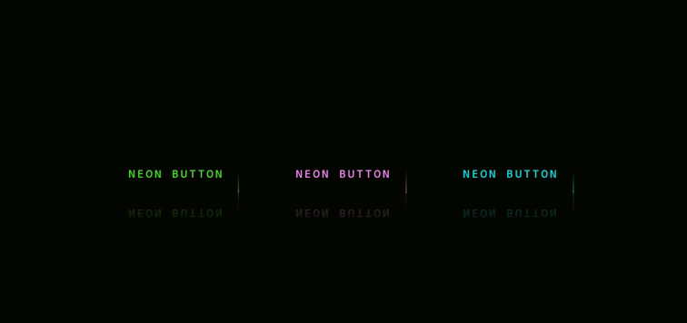

# Neon-Light-Buttons-Hover-Effects
Hover com efeito de Luz de Neon aplicado aos Buttons.  
Tutorial disponível no Canal do Youtube: Online Tutorials do Muhammad Irshad 
Tecnologias Utilizadas: HTML e CSS.

<a href="https://guilherme-rsm.github.io/Neon-Light-Buttons-Hover-Effects/">Clique aqui para visualizar no Github Pages</a>
